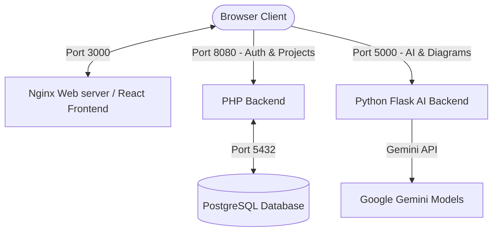

# Dokari - System Documentation

Dokari is a technical documentation generator. It parses codebase files, computes documentation quality health ratings, suggests context-based code comment fixes, and builds professional API specifications, READMEs, and architecture diagrams using Google Gemini.

---

## Brand Name & Meaning

The name **Dokari** represents the core essence of the documentation platform through three etymologies:

1.  **"The Document Maker" (Sanskrit / Hindi Connection)**:
    *   **Dok**: Shorthand for *Document*.
    *   **Kari** (कारी): A Sanskrit/Hindi suffix meaning *maker*, *creator*, or *efficient doer*.
    *   **Definition**: *"The Creator of Documents"*, representing the automated, efficient generation of files.
2.  **"Bringing Light to Code" (Japanese Connection)**:
    *   **Dok**: Shorthand for *Dokument* (Document).
    *   **Hikari** (光): The Japanese word for *light* or *clarity*.
    *   **Definition**: *"Document Clarity"*, representing how the health analyzer sheds light on the codebase by grading comment quality.

---

## 1. System Architecture

Dokari is designed as a secure, containerized multi-service web application composed of five primary layers:



### Component Details
1.  **Frontend (React SPA)**: A Vite-powered React single page application styled with a flat, dark slate theme. Serves as the interactive user dashboard.
2.  **Web Server (Nginx)**: Containerized web server that compiles the React app and serves the static production bundle.
3.  **Core Backend (PHP)**: Restful backend that handles user registration, secure session authentication, project workspaces, and uploaded file persistence.
4.  **AI Backend (Flask)**: Python microservice that orchestrates code analysis, documentation formatting, diagram generation, and coordinates with Google Gemini.
5.  **Database (PostgreSQL)**: Relational database storing credentials, workspace project headers, files, and generated documents.

---

## 2. Core Features & Implementations

### A. Workspace & Guest Mode
*   **Guest Mode**: Enabled by default on launch. Users can view a preloaded read-only project preview with mock health scores, generated READMEs, and diagrams to test the interface without friction.
*   **Write Operations Lock**: Actions like uploading new source files, generating new documentation, or saving project parameters require account authorization. When a guest attempts these actions, a flat solid Auth Modal automatically triggers to prompt Registration or Login.

### B. Documentation Health Score
*   **Quality Metrics**: Analyzes comment density, docstring presence, class/method explanation clarity, and function parameter declarations.
*   **Rating**: Scores are evaluated on a scale of 0 to 100.
*   **Suggestions Sidebar**: Provides specific recommendations for improvement (e.g. *Add class docstring to main.py:Calculator*).

### C. Interactive Code Fixes
*   Clicking **"Fix"** next to any health score suggestion requests a precise docstring or comment block from Google Gemini.
*   The system opens a code diff modal displaying the copyable fix so developers can instantly apply it to their codebase.

### D. Automated README & API Document Builder
*   **API Documentation**: Parses module endpoints, helper arguments, functions, returns, and formats them into a standard markdown API spec.
*   **README.md**: Evaluates files structure and actual code content to generate setup guides, features, and precise code usage examples.

### E. Architecture Diagram Generator
*   Uses a custom AST-like Python file parser on the server to scan files for classes, function definitions, and dependencies (`imports`).
*   Draws visual flowchart blocks programmatically using the Python Imaging Library (**PIL**), outputs a PNG file, and serves it dynamically.

### F. Keyless System Chatbot
*   Runs 100% locally on the browser frontend. 
*   Uses a regular expression word-boundary scoring algorithm (`findLocalAnswer`) to match user questions to a pre-defined knowledge database about the Dokari platform.
*   Steers unrelated user queries back to the platform description, avoiding API key requirements or rate limits.

---

## 3. Database Schema

The PostgreSQL database (`dokari`) is initialized with the following structure:

```sql
-- Users Table
CREATE TABLE users (
    id SERIAL PRIMARY KEY,
    username VARCHAR(50) UNIQUE NOT NULL,
    password VARCHAR(255) NOT NULL,
    created_at TIMESTAMP DEFAULT CURRENT_TIMESTAMP
);

-- Projects Table
CREATE TABLE projects (
    id SERIAL PRIMARY KEY,
    user_id INTEGER REFERENCES users(id) ON DELETE CASCADE,
    name VARCHAR(100) NOT NULL,
    description TEXT,
    created_at TIMESTAMP DEFAULT CURRENT_TIMESTAMP
);

-- Project Source Files
CREATE TABLE project_files (
    id SERIAL PRIMARY KEY,
    project_id INTEGER REFERENCES projects(id) ON DELETE CASCADE,
    filename VARCHAR(255) NOT NULL,
    content TEXT,
    created_at TIMESTAMP DEFAULT CURRENT_TIMESTAMP,
    UNIQUE(project_id, filename)
);

-- Generated Documentation Table
CREATE TABLE documents (
    id SERIAL PRIMARY KEY,
    project_id INTEGER REFERENCES projects(id) ON DELETE CASCADE,
    type VARCHAR(50) NOT NULL, -- 'api', 'readme', 'architecture'
    content TEXT,
    updated_at TIMESTAMP DEFAULT CURRENT_TIMESTAMP
);
```

---

## 4. API Endpoints Reference

### PHP Core Backend (Port `8080`)
*   `POST /api/auth/register` - Registers a new user account.
*   `POST /api/auth/login` - Authenticates user and returns credentials.
*   `GET /api/projects` - Retrieves all projects belonging to the authorized user.
*   `POST /api/projects` - Creates a new project workspace.
*   `GET /api/projects/{id}/files` - Lists source files uploaded to a project.
*   `POST /api/projects/{id}/files` - Uploads a list of files to a project.
*   `DELETE /api/projects/{id}/files/{filename}` - Deletes a file.
*   `GET /api/projects/{id}/documents` - Fetches generated project documentation.
*   `POST /api/projects/{id}/documents` - Saves generated documentation.

### Flask AI Backend (Port `5000`)
*   `POST /generate/health` - Evaluates documentation score (0-100) and suggestions.
*   `POST /generate/api` - Generates markdown API specifications.
*   `POST /generate/readme` - Generates markdown project READMEs.
*   `POST /generate/diagram` - Parses dependencies and draws the PNG flowchart.
*   `POST /generate/chat` - Generates specific docstring fixes.

---

## 5. AI Fallback & Quota Architecture

To support users on the Google Gemini Free Tier, Dokari implements a robust fallback sequence in [ai_processor.py](file:///C:/Users/acer/.gemini/antigravity/scratch/docforge/flask-ai/ai_processor.py). 

Free tier keys have a rate limit of **5 requests per minute** and a daily limit of **20 requests per day** on standard flash models. If a query hits a `429 (Resource Exhausted)` quota exception, the system automatically catches it and transparently retries using the next model in the fallback chain:

1.  **`gemini-2.5-flash`** (Primary high-speed model)
2.  **`gemini-2.5-flash-lite`** (Secondary fallback model)
3.  **`gemini-3.1-flash-lite`** (Third-level fallback)
4.  **`gemini-flash-lite-latest`** (Fourth-level fallback)
5.  **`gemini-3-flash-preview`** (Final experimental preview fallback)

This guarantees maximum availability and keeps the document builders operational.
